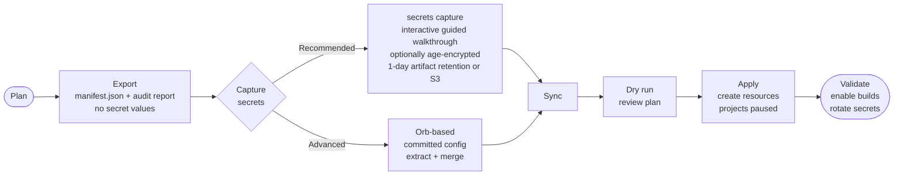

<!--
  BADGE NOTES:
  - CircleCI build-status badge removed: "Status Badges" is not enabled for this project
    (dl.circleci.com/status-badge/... returns 404). To restore, enable
    Project Settings → Status Badges in the CircleCI UI for AwesomeCICD/circleci-org-migration-cli,
    then re-add:
      [](https://dl.circleci.com/status-badge/redirect/gh/AwesomeCICD/circleci-org-migration-cli/tree/main)
  - Orb-registry badge removed: badges.circleci.com/orbs/awesomecicd/circleci-org-migration.svg
    returns 404 because the orb is PRIVATE. Re-add once the orb is public after the
    CircleCI-Labs namespace move:
      [](https://circleci.com/developer/orbs/orb/cci-labs/circleci-org-migration)
-->
[](https://github.com/AwesomeCICD/circleci-org-migration-cli/releases/latest)
[](https://github.com/AwesomeCICD/homebrew-tap)
[](https://go.dev)
[](https://goreportcard.com/report/github.com/AwesomeCICD/circleci-org-migration-cli)
[](https://conventionalcommits.org)

# circleci-migrate

`circleci-migrate` moves configuration data from one CircleCI organization to another — contexts, project settings, environment variables, org-level settings, runner resource classes, and more — with a safe, auditable approach that never requires you to expose secrets in plain text until they are needed.

<p align="center">
  
</p>

---

## Migration process at a glance



---

## What it captures and transfers

| Category | What is transferred |
|---|---|
| **Contexts** | Names, env-var names + values (with secret bundle), expression restrictions, group restrictions |
| **Projects** | Advanced settings, env-var names + values, checkout key metadata, webhooks, schedules, pipeline definitions (App), triggers (App — created disabled), project OIDC |
| **Org settings** | v1.1 feature flags, OIDC custom claims, URL-orb allow list, config policies (Rego), OTel exporters, technical/security contacts, storage retention, spend budgets, block-unregistered-users, release-tracker settings, environment hierarchy |
| **Org orb list** | Org-level orb list (manual republish noted in report) |
| **Runner resource classes** | Self-hosted runner resource classes (supply `--runner-namespace`) |
| **Secret values** | Via interactive `secrets capture` (CLI-orchestrated, no committed config) or the orb |

Items that require manual follow-up (SSO/SAML, audit-log streaming, webhook HMAC secrets, OTel header values, checkout key private material) are listed in the per-export `migration-report.md`.

---

## Recommended path — step by step

This is the fastest, safest path for most migrations. All commands are interactive when run on a terminal — you will be prompted for each option with sensible defaults.

### Step 1 — Set tokens

```bash
export CIRCLECI_SOURCE_TOKEN="<source-org-personal-api-token>"
export CIRCLECI_DEST_TOKEN="<destination-org-personal-api-token>"
```

### Step 2 — Run the guided migration walkthrough

```bash
circleci-migrate migrate
```

Running `migrate` with no flags on an interactive terminal launches a step-by-step guided walkthrough. It will ask for source org, destination org, tokens, and preferences. This is the recommended path for first-time use and manual one-off migrations.

For scripting and CI pipelines, provide flags explicitly (see [Command reference — `migrate`](#migrate) below).

### Step 3 — Capture secret values (guided)

Because the CircleCI API never returns secret values, capturing them requires running inside a CircleCI pipeline. `secrets capture` handles this for you:

```bash
circleci-migrate secrets capture
```

Running `secrets capture` with no flags launches the guided walkthrough. It will:

1. Read the manifest to enumerate contexts and projects.
2. Let you select which contexts and projects to capture.
3. Ask you to choose a host project for context extraction (any project works).
4. Offer to **encrypt** the artifact with [age](https://age-encryption.org/) — plaintext secrets never persist in CircleCI storage (default: yes).
5. Let you choose storage: CircleCI artifact, S3, or both.
6. Offer to set artifact retention to 1 day (minimum) before triggering the run (default: yes).
7. Show a confirmation summary before proceeding.

The result is `secrets.json` on your local machine, ready for the sync step.

### Step 4 — Sync to the destination (dry run, then apply)

```bash
# Dry run — review the plan, nothing is written
circleci-migrate sync \
  --manifest manifest.json \
  --secrets secrets.json

# Apply when satisfied
circleci-migrate sync \
  --manifest manifest.json \
  --secrets secrets.json \
  --apply
```

Or skip separate export/sync and use the all-in-one `migrate`:

```bash
circleci-migrate migrate \
  --source-org gh/acme \
  --dest-org gh/acme-cloud \
  --secrets secrets.json \
  --apply --yes \
  --output manifest.json \
  --report migration-report.md
```

### Step 5 — Validate and rotate

After the sync completes:

1. Compare contexts and env-var names in the destination against `migration-report.md`.
2. Verify project settings, webhooks, schedules, and pipeline definitions.
3. Enable builds when ready (the sync prompts you, or pass `--yes`).
4. Rotate every captured secret value and delete `secrets.json`.

---

## Security best practices

**The secret bundle (`secrets.json`) contains plaintext environment-variable values. Treat it with the same care as a password file.**

- **Use encryption.** Run `secrets capture` interactively and select "Encrypt the captured secrets?" (the default is yes). With `--encrypt`, the artifact stored in CircleCI is age-encrypted — plaintext secrets never persist in CircleCI artifact storage.
- **Set 1-day artifact retention.** The guided walkthrough offers to set artifact retention to 1 day before triggering the extraction run (the default is yes). This lowers the entire org's artifact retention temporarily; the prior value is logged so you can restore it.
- **Dry run first.** Always review the plan output before passing `--apply`. The dry run shows every action as `created (would create)` — nothing is written until you explicitly apply.
- **Protect `secrets.json`.** The file is written with `0600` permissions. Do not commit it to version control. Delete it once the sync is complete.
- **Use a private project.** Run the extraction pipeline under a private CircleCI project.
- **Restrict contexts.** After migration, review and restrict sensitive contexts to specific groups or projects in the destination org.
- **Rotate secrets after cutover.** Every captured secret should be rotated once the destination is confirmed healthy.

---

## Install

<!--
  NOTE: temp home is github.com/AwesomeCICD (orb: awesomecicd/circleci-org-migration);
  moves to CircleCI-Labs (repo + homebrew-tap, orb namespace cci-labs) on the Labs move.
-->

### Homebrew (recommended)

```bash
brew install AwesomeCICD/tap/circleci-migrate
```

> **Future namespace:** the tap and orb will move to `CircleCI-Labs` / `cci-labs` when
> the tool is republished under CircleCI Labs. The `AwesomeCICD` names are the current
> production location.

### `go install`

```bash
go install github.com/AwesomeCICD/circleci-org-migration-cli@latest
```

Requires Go 1.26 or later. The installed binary is placed in `$GOPATH/bin` (or `$HOME/go/bin`).

### Prebuilt binary

Prebuilt binaries for Linux and macOS are attached to every release on
[GitHub Releases](https://github.com/AwesomeCICD/circleci-org-migration-cli/releases).

Archive naming: `circleci-migrate_<version>_<os>_<arch>.tar.gz`
Supported combinations: `linux_amd64`, `linux_arm64`, `darwin_amd64`, `darwin_arm64`.

```bash
# Example — Linux amd64, v0.3.0. Replace version, os, and arch as needed.
VERSION=v0.3.0
curl -sfL "https://github.com/AwesomeCICD/circleci-org-migration-cli/releases/download/${VERSION}/circleci-migrate_${VERSION#v}_linux_amd64.tar.gz" \
  | tar -xz
sudo install -m 0755 circleci-migrate /usr/local/bin/
```

### Build from source

```bash
git clone https://github.com/AwesomeCICD/circleci-org-migration-cli.git
cd circleci-org-migration-cli
make build            # produces ./bin/circleci-migrate
# or without make:
go build -o bin/circleci-migrate .
```

**Requirements:** Go 1.26 or later.

### Using the orb (advanced — committed config, full control)

The `awesomecicd/circleci-org-migration` orb provides an alternative secret-capture path for teams that prefer committed config, large-scale matrix captures, or maximum auditability.

```yaml
version: "2.1"
orbs:
  migrate: awesomecicd/circleci-org-migration@0.2.0

workflows:
  capture-secrets:
    jobs:
      - migrate/extract_context:
          name: extract-my-context
          context_name: my-context
          context:
            - my-context
      - migrate/merge:
          requires:
            - extract-my-context
```

See [Phase 2 — Option B: orb-based](#option-b--orb-based-committed-config-full-control) for full usage, and [docs/examples.md](docs/examples.md) for copy-pasteable multi-context and matrix examples.

> **Note:** the orb is currently PRIVATE. Your CircleCI organization must be granted access.
> It will be republished as `cci-labs/circleci-org-migration` when the tool moves to CircleCI Labs.

### Releasing

Releases are automated via [release-please](https://github.com/googleapis/release-please)
and [GoReleaser](https://goreleaser.com/), driven by
[Conventional Commits](https://www.conventionalcommits.org/):

```
Conventional Commit lands on main
  → release-please opens/updates a "release PR" (computes the version bump + changelog)
  → merge the release PR
  → release-please creates the git tag + GitHub release
  → CircleCI (watching this repo) runs GoReleaser on the new tag, which builds
    and APPENDS the cross-platform binaries + checksums to that release,
    publishes the Homebrew formula to AwesomeCICD/homebrew-tap, and
    publishes the orb to the CircleCI orb registry.
```

release-please owns version bumps and the changelog; GoReleaser only builds and
appends artifacts. The Homebrew formula is published to the
`AwesomeCICD/homebrew-tap` repo (becomes `CircleCI-Labs/homebrew-tap` on the Labs
move) and requires a push token for that tap repo.

---

## Three-phase walkthrough (advanced / scripting path)

The guided `migrate` and `secrets capture` commands above cover the common case.
This section documents the underlying phases for teams that need to inspect or
edit the manifest between steps, or prefer full scripting control.

### Phase 1 — Export the source org

```bash
circleci-migrate export \
  --org gh/acme \
  --source-token "$SRC_TOKEN"
# Produces: manifest.json  migration-report.md
```

Review `migration-report.md`. Items requiring manual follow-up (group restrictions, project restrictions, SSO, audit-log streaming) are listed under "Warnings & manual follow-ups".

The `--org` slug format:
- `gh/<org>` for GitHub OAuth organizations
- `circleci/<org-id>` for GitHub App or GitLab organizations

### Phase 2 — Capture secrets

Because the API never returns secret values, capturing them requires running inside a CircleCI job.

#### Option A — CLI-orchestrated (`secrets capture`, recommended)

`secrets capture` orchestrates the whole extraction from your local machine. It uses the CircleCI Pipelines API to trigger a run with an inline (unversioned) config in your source org, waits for the run to complete, and downloads the resulting secret bundle — all without you committing a `.circleci/config.yml`:

```bash
# Interactive guided walkthrough (recommended)
circleci-migrate secrets capture

# Non-interactive with encryption and 1-day retention
circleci-migrate secrets capture \
  --manifest manifest.json \
  --encrypt --generate-key \
  --artifact-retention-days 1 \
  --enable-trigger \
  --output secrets.json

# With S3 storage
circleci-migrate secrets capture \
  --manifest manifest.json \
  --encrypt --generate-key \
  --storage s3 --s3-bucket my-migration-bucket --s3-prefix migration/
```

| Flag | Default | Description |
|---|---|---|
| `--manifest` | *(prompted)* | Manifest produced by `export` |
| `--output`, `-o` | `secrets.json` | Path to write the merged secret bundle |
| `--context` | *(all in manifest)* | Context name(s) to capture |
| `--project` | *(all in manifest)* | Project slug(s) to capture project env vars for |
| `--host-project` | *(prompted)* | Project to run context extraction under (any project works) |
| `--encrypt` | `false` | Encrypt artifact with age — plaintext never hits CircleCI storage |
| `--generate-key` | `false` | Auto-generate a fresh age X25519 keypair (use instead of `--ssh-public-key`) |
| `--ssh-public-key` | | Path to existing SSH public key or age recipients file |
| `--ssh-private-key` | | Path to SSH private key for local decryption (defaults to `~/.ssh/id_ed25519`) |
| `--storage` | `artifact` | Where to store the bundle: `artifact`, `s3`, or `both` |
| `--s3-bucket` | | S3 bucket name (required for `--storage s3\|both`) |
| `--s3-prefix` | | S3 key prefix (optional; e.g. `migration/`) |
| `--artifact-retention-days` | `0` | Set org artifact retention to N days before the run (recommended: `1`) |
| `--branch` | `main` | Branch to run the extraction pipeline on |
| `--enable-trigger` | `false` | Enable api-trigger-with-config if needed, restore after capture |
| `--remove-restrictions` | `false` | Temporarily remove context restrictions before extraction |
| `--skip-restricted-contexts` | `true` | Skip contexts that have restrictions |
| `--poll-timeout` | `10m` | How long to wait for the pipeline run to complete |
| `--no-input` | `false` | Disable all prompts; error immediately on missing required values |

#### Option B — Orb-based (committed config, full control)

Alternatively, commit `manifest.json` to your source org's repository (it contains no secrets) and add a workflow using the `awesomecicd/circleci-org-migration` orb:

```yaml
# .circleci/config.yml in your SOURCE org
version: "2.1"
orbs:
  migrate: awesomecicd/circleci-org-migration@0.2.0

workflows:
  capture-secrets:
    jobs:
      # One job per context. Each job must reference exactly that context
      # so its variables are injected — do not mix contexts in one job.
      - migrate/extract_context:
          name: extract-deploy-prod
          context_name: deploy-prod
          context:
            - deploy-prod
      - migrate/extract_context:
          name: extract-shared
          context_name: shared
          context:
            - shared
      # Merge all per-context bundles into a single secrets.json artifact.
      - migrate/merge:
          requires:
            - extract-deploy-prod
            - extract-shared
```

Download `secrets.json` from the `merge` job's artifacts. This file contains plaintext values — see [Security best practices](#security-best-practices) above.

The orb (`awesomecicd/circleci-org-migration@0.2.0`, PRIVATE — for in-pipeline secret capture) fetches the prebuilt binary from GitHub Releases automatically. For large numbers of contexts, use a matrix to fan out a single job stanza instead of writing one stanza per context (see [docs/examples.md](docs/examples.md#example-5--secrets-capture-in-detail)).

> **Note:** the orb is currently PRIVATE. To use it, your CircleCI organization must be granted access. It will be republished as `cci-labs/circleci-org-migration` when the tool moves to CircleCI Labs.

### Phase 3 — Sync to the destination org

```bash
# Dry run first — review the plan, nothing is written
circleci-migrate sync \
  --manifest manifest.json \
  --secrets secrets.json \
  --dest-token "$DST_TOKEN"

# Apply when you are satisfied with the plan
circleci-migrate sync \
  --manifest manifest.json \
  --secrets secrets.json \
  --dest-token "$DST_TOKEN" \
  --apply
```

Sync is **idempotent**: existing contexts are reused by name; re-running is safe.

---

## Project creation and enabling builds

When `sync` (or `migrate`) creates projects in the destination org with `--apply`, they are created in a **paused** state — no webhook is installed and no builds fire until you explicitly enable them. This is intentional: it gives you time to review the new org before any pipeline runs.

**OAuth orgs:** a project is created as a shell; to enable builds the project must be "followed", which installs a deploy key and webhook.

**GitHub App orgs:** a project is created along with its pipeline definitions and triggers. Triggers are created **disabled (paused)** and must be explicitly enabled.

After `--apply` completes, you are prompted to enable builds:

```
Enable builds for 3 project(s) now? [y/N]:
```

To skip the prompt and enable automatically:

```bash
circleci-migrate sync --manifest manifest.json --apply --yes
# or with migrate:
circleci-migrate migrate --source-org gh/acme --dest-org gh/acme-cloud --apply --yes
```

To skip for now and enable later, just press Enter (or run without a TTY). You can re-run with `--apply --yes` at any time — it is safe to call again.

> **Note on GitHub App webhook/schedule triggers:** triggers of type `webhook` or `schedule` require manual recreation because the webhook HMAC secret cannot be migrated and schedule-trigger creation via the Trigger API is a planned future addition. The sync report will list these as `manual` actions.

---

## What gets migrated

| Resource | Captured | Synced | Notes |
|---|---|---|---|
| Context names | Yes | Yes | Created by name; destination assigns its own ID |
| Context env-var names | Yes | Yes | Names captured via API |
| Context env-var values | Via `secrets capture` or orb | Yes (with secret bundle) | API never returns values |
| Expression restrictions | Yes | Yes | Recreated on sync |
| Group restrictions | Yes (name recorded) | Yes (by name lookup) | Resolved to destination group UUID by name; "All members" maps to org ID |
| Project restrictions | Yes (name recorded) | Manual | Source-org project IDs do not transfer; recreate manually |
| Project creation | Yes (metadata) | Yes | Created paused; enable-builds step required |
| Project advanced settings | Yes | Yes | `autocancel_builds`, `build_fork_prs`, etc. |
| Project env-var names | Yes | Yes | Names captured via API |
| Project env-var values | Via `secrets capture` or orb | Yes (with secret bundle) | Same constraint as context values |
| Pipeline definitions (App) | Yes | Yes | Created on new App projects; external_id reused or resolved via GitHub API |
| Pipeline triggers (App) | Yes | Yes (disabled) | Created disabled; enabled in enable-builds step. Webhook/schedule triggers: manual |
| Org feature flags | Yes | Yes | Full flag map via v1.1 API; safe/relevant flags written back |
| OIDC custom claims | Yes | Yes | Audience list and TTL via v2 API; captured at both org and project level |
| URL-orb allow list | Yes | Yes | GitHub App / circleci-type orgs only |
| Config policies (Rego) | Yes | Yes | Scale plan only; enforcement toggle included |
| OTel exporters | Yes | Yes (partial) | Exporter configs recreated; header values are redacted by the API and must be set manually |
| Org contacts (tech/security) | Yes | Yes | Primary and security contact email lists |
| Storage retention | Yes (read) | Applied before extraction | Set via `--artifact-retention-days` during `secrets capture` |
| Spend budgets | Yes | Yes | Org-level spend budget configurations |
| Block unregistered users | Yes | Yes | Org-level setting |
| Release-tracker settings | Yes | Yes | Org release-tracker configurations |
| Environment hierarchy | Yes (reference/manual) | Reference | Captured; manual sync noted in report |
| Org orb list | Yes | Manual | Orbs must be republished in destination namespace |
| Self-hosted runner resource classes | Yes (with `--runner-namespace`) | Yes (with `--dest-runner-namespace`) | Namespace must exist in destination |
| Audit-log streaming configs | Yes (captured) | Manual | AWS ARN/bucket is source-specific; recreate manually |
| SSO (SAML) configuration | Yes (captured) | Manual | Requires DNS verification + IdP setup; never auto-written |
| Checkout key fingerprints | Yes (public metadata only) | Not yet | Private keys cannot be exported; regenerate on destination |
| Webhooks (OAuth projects) | Yes (metadata) | Yes | HMAC signing-secret must be set manually |
| Scheduled pipelines (OAuth) | Yes (metadata) | Yes | Recreated on OAuth destinations only |
| Webhooks (App projects) | Yes (metadata) | Yes | HMAC signing-secret must be set manually |
| Scheduled pipelines (App) | Yes (metadata) | Manual | App-org schedules require the Trigger API (planned) |
| Additional SSH keys | No | No | Not available via API |

---

## GitHub OAuth vs GitHub App

The org slug format affects which APIs are available and how projects are managed:

- **GitHub OAuth** (`gh/<org>`): full v1.1 and v2 API coverage, including project discovery via followed projects. Projects are followed to install webhooks.
- **GitHub App** (`circleci/<org-id>`): v2 API only. Project slugs use UUIDs; projects use pipeline definitions and triggers instead of webhooks. Project discovery uses the private `/api/private/project` endpoint.

### Same-type migrations (recommended first step)

The tool is designed primarily for **same-type** migrations:

- **OAuth → OAuth** (`gh/acme` → `gh/acme-cloud`): fully automated with a name mapping.
- **App → App** (`circleci/<src-uuid>` → `circleci/<dst-uuid>`): fully automated; the `--github-token` flag helps resolve repository external IDs when the destination is in a different GitHub org.

### Cross-type migrations

A **GitHub App** org that also has GitHub-connected repositories registers as two separate CircleCI organization records (one OAuth record, one App record). Migrating such a setup between two complete environments typically requires two separate runs — one for the OAuth side and one for the App side.

**OAuth → App** (pure cross-type) is a documented future direction. Key data-loss caveats to be aware of:

- GitHub App never builds fork PRs; if your source org has `build_fork_prs` enabled the setting cannot be replicated.
- Multiple pipeline definitions per App project cannot collapse to a single OAuth project config.

See [docs/examples.md](docs/examples.md) for complete worked examples of each migration type.

---

## Global flags

These flags are available on every sub-command. Environment variables are read before flag parsing, so they act as defaults that CLI flags can override.

| Flag | Environment variable | Default | Description |
|---|---|---|---|
| `--host` | `CIRCLECI_HOST` | `https://circleci.com` | CircleCI host URL (useful for Server installs) |
| `--token` | `CIRCLECI_CLI_TOKEN` | | Personal API token — fallback for both orgs |
| `--source-token` | `CIRCLECI_SOURCE_TOKEN` | | API token for the source org (read operations) |
| `--dest-token` | `CIRCLECI_DEST_TOKEN` | | API token for the destination org (write operations) |
| `--debug` | | `false` | Enable verbose HTTP request/response logging |

---

## Command reference

### `migrate`

All-in-one: exports the source org and syncs it into the destination in a single command. The manifest is kept in memory; use `-o` to save it to disk.

**Recommended path:** run `circleci-migrate migrate` on an interactive terminal with no flags to launch the guided walkthrough. It prompts for each required value and provides an explicit plan before applying anything.

When `--source-org` and `--dest-org` are both provided, `migrate` runs non-interactively — suitable for CI pipelines. Pass `--no-input` to error immediately if any required value is missing instead of blocking on a prompt.

```bash
# Interactive guided walkthrough (recommended)
circleci-migrate migrate

# Dry run (non-interactive)
circleci-migrate migrate \
  --source-org gh/acme --dest-org gh/acme-cloud

# Apply with secret bundle
circleci-migrate migrate \
  --source-org gh/acme --dest-org gh/acme-cloud \
  --secrets secrets.json --apply

# Apply and auto-confirm enabling builds, save manifest + report
circleci-migrate migrate \
  --source-org gh/acme --dest-org gh/acme-cloud \
  --apply --yes \
  -o manifest.json --report migration-report.md

# CI pipeline (non-interactive, apply immediately)
circleci-migrate migrate \
  --source-org gh/acme --dest-org gh/acme-cloud \
  --secrets secrets.json --apply --yes --no-input
```

`migrate` uses the source token (`--source-token` / `CIRCLECI_SOURCE_TOKEN`) for the export step and the dest token (`--dest-token` / `CIRCLECI_DEST_TOKEN`) for the sync step.

| Flag | Default | Description |
|---|---|---|
| `--source-org` | *(required, or prompted interactively)* | Source organization slug (`gh/<org>` or `circleci/<org-id>`) |
| `--dest-org` | *(required, or prompted interactively)* | Destination organization slug |
| `--secrets` | `secrets.json` | Path to a captured secret bundle (optional; file is silently skipped if absent) |
| `--mapping` | | Path to a source→destination mapping file (optional) |
| `--apply` | `false` | Write changes to destination (default: dry run) |
| `--yes`, `-y` | `false` | Auto-confirm enabling builds after project creation (skip the interactive prompt) |
| `--no-input` | `false` | Disable all interactive prompts; error if a required value is missing |
| `--missing-secrets` | `skip` | How to handle variables with no captured value: `skip` or `placeholder` |
| `--github-token` | `$GITHUB_TOKEN` | GitHub PAT used to resolve repository IDs for App pipeline definitions |
| `--dest-github-org` | | Destination GitHub org name (used to resolve repo `external_id` when the destination is in a different GitHub org than the source) |
| `--runner-namespace` | | Source runner namespace to capture self-hosted runner resource classes from |
| `--dest-runner-namespace` | | Destination runner namespace for recreating runner resource classes |
| `--skip-contexts` | `false` | Skip exporting and syncing contexts |
| `--skip-projects` | `false` | Skip exporting and syncing projects |
| `--skip-org-settings` | `false` | Skip syncing org-level settings |
| `--skip-extras` | `false` | Skip checkout keys, webhooks, and schedules |
| `--output`, `-o` | | If set, save the exported manifest to this path |
| `--report` | | If set, save the human-readable audit report to this path |

### `export`

Reads the source org and produces `manifest.json` and `migration-report.md`. Read-only — never writes to CircleCI. Safe to run multiple times.

```bash
circleci-migrate export --org gh/acme --source-token "$SRC_TOKEN"
circleci-migrate export --org gh/acme -o acme.json --report acme-audit.md
circleci-migrate export --org gh/acme --projects gh/acme/web,gh/acme/api
```

| Flag | Default | Description |
|---|---|---|
| `--org` | *(required)* | Source organization slug (`gh/<org>` or `circleci/<org-id>`) |
| `--output`, `-o` | `manifest.json` | Path to write the JSON manifest |
| `--report` | `migration-report.md` | Path to write the audit report |
| `--projects` | *(all followed)* | Explicit project slugs to export, comma-separated |
| `--runner-namespace` | | Runner namespace to include self-hosted runner resource classes |
| `--skip-contexts` | `false` | Skip exporting contexts |
| `--skip-projects` | `false` | Skip exporting projects |
| `--skip-extras` | `false` | Skip checkout keys, webhooks, and schedules |

> **Project discovery:** `export` discovers projects through the followed-projects list (v1.1 API) for OAuth orgs and through the private project-list endpoint for App orgs. If the source token's user does not have access to every repository, pass an explicit `--projects` list for complete coverage.

### `secrets capture`

**Recommended** CLI-orchestrated secret extraction. Submits an inline (unversioned) pipeline config to the source org via the CircleCI Pipelines API, waits for the run to finish, and downloads the merged secret bundle — all without committing a `.circleci/config.yml`.

Run with no flags on a TTY to launch the **interactive guided walkthrough**.

```bash
# Interactive guided walkthrough (recommended)
circleci-migrate secrets capture

# Non-interactive with encryption and 1-day retention
circleci-migrate secrets capture \
  --manifest manifest.json \
  --encrypt --generate-key \
  --artifact-retention-days 1 \
  --enable-trigger \
  --output secrets.json

# With S3 storage
circleci-migrate secrets capture \
  --manifest manifest.json \
  --encrypt --generate-key \
  --storage s3 --s3-bucket my-migration-bucket --s3-prefix migration/
```

See [Phase 2 — Option A](#option-a--cli-orchestrated-secrets-capture-recommended) for full flag reference.

### `secrets extract`

Run this **inside a CircleCI job** that references the target context. Reads variable names from the manifest, captures their live values from the job environment, and writes a secret bundle. This is used by the orb internally.

```bash
circleci-migrate secrets extract \
  --manifest manifest.json \
  --context deploy-prod \
  --output secrets-deploy-prod.json
```

| Flag | Default | Description |
|---|---|---|
| `--manifest` | *(required)* | Path to the export manifest |
| `--context` | | Context name to capture (mutually exclusive with `--project`) |
| `--project` | | Project slug to capture (mutually exclusive with `--context`) |
| `--output`, `-o` | `secrets.json` | Path to write or append the secret bundle |
| `--strict` | `false` | Fail if any expected variable is missing from the environment |

### `secrets merge`

Combines multiple per-context/project bundles into one file.

```bash
circleci-migrate secrets merge \
  --output secrets.json \
  secrets-deploy-prod.json secrets-shared.json
```

### `secrets decrypt`

Decrypts an age-encrypted secret bundle downloaded from a CircleCI artifact.

```bash
circleci-migrate secrets decrypt \
  --identity migration-identity.age \
  --input secrets.json.age \
  --output secrets.json
```

### `sync`

Recreates exported data in the destination org. **Dry-run by default** — review the plan, then re-run with `--apply`.

```bash
circleci-migrate sync \
  --manifest manifest.json \
  --secrets secrets.json \
  --dest-token "$DST_TOKEN" \
  --apply
```

| Flag | Default | Description |
|---|---|---|
| `--manifest` | *(required)* | Path to the export manifest |
| `--secrets` | `secrets.json` | Path to the secret bundle (optional; silently skipped if absent) |
| `--mapping` | | Path to a source→destination mapping file (optional) |
| `--apply` | `false` | Write changes to destination (default: dry run) |
| `--yes`, `-y` | `false` | Auto-confirm enabling builds after project creation |
| `--missing-secrets` | `skip` | How to handle variables with no captured value: `skip` or `placeholder` |
| `--github-token` | `$GITHUB_TOKEN` | GitHub PAT used to resolve repository IDs for App pipeline definitions |
| `--dest-github-org` | | Destination GitHub org name. Use when repos have moved to a new GitHub org. Requires `--github-token`. |
| `--dest-runner-namespace` | | Destination runner namespace for recreating self-hosted runner resource classes |
| `--skip-contexts` | `false` | Skip syncing contexts |
| `--skip-projects` | `false` | Skip syncing projects |
| `--skip-org-settings` | `false` | Skip syncing org-level settings (feature flags, OIDC, URL-orb allow list, config policies) |

**Missing secrets:** if a variable was not captured (or you run without a secret bundle), `--missing-secrets skip` (default) omits it from the destination. Pass `--missing-secrets placeholder` to write `REPLACE_ME` so the variable exists and can be updated later.

**Cross-org rename or GitHub App destination:** supply a mapping file:

```json
{
  "org": { "from": "gh/acme", "to": "gh/acme-cloud" },
  "projects": {
    "gh/acme/web": "gh/acme-cloud/web"
  }
}
```

```bash
circleci-migrate sync \
  --manifest manifest.json \
  --secrets secrets.json \
  --mapping mapping.json \
  --apply
```

### `orb inline`

Inlines private orbs referenced in a CircleCI config file, replacing orb stanza references with the orb's actual source. This is useful during the namespace-transfer overlap window: while an orb's namespace is being moved from `awesomecicd/` to `cci-labs/`, you can inline the orb's current source so the config continues to work regardless of which namespace is active.

```bash
# Inline all private orbs in a config file (writes to stdout by default)
circleci-migrate orb inline \
  --config .circleci/config.yml \
  --token "$CCI_TOKEN"

# Write the result back to the file in place
circleci-migrate orb inline \
  --config .circleci/config.yml \
  --token "$CCI_TOKEN" \
  --output .circleci/config.yml
```

| Flag | Default | Description |
|---|---|---|
| `--config` | `.circleci/config.yml` | Path to the CircleCI config file to inline |
| `--output`, `-o` | *(stdout)* | Path to write the inlined config (defaults to stdout) |
| `--token` | `$CIRCLECI_CLI_TOKEN` | Personal API token with access to the private orb(s) |

### `version`

Prints the version number, git commit SHA, and OS/architecture.

```bash
circleci-migrate version
```

---

## Further reading

- [Worked migration examples](docs/examples.md) — complete, copy-pasteable examples for every scenario (OAuth→OAuth, App→App, mixed, cross-type, repo-move, runners)
- [Cutover runbook](docs/cutover-runbook.md) — operator checklist for production cutovers
- [Architecture and data flow](docs/architecture.md)
- [CircleCI API usage](docs/api-usage.md)
- [Testing guide](docs/testing.md)
- [CLI reference](docs/cli/README.md) — auto-generated per-command flag reference
- [Man pages](man/) — auto-generated man pages for all commands
- [Contributing](CONTRIBUTING.md)
