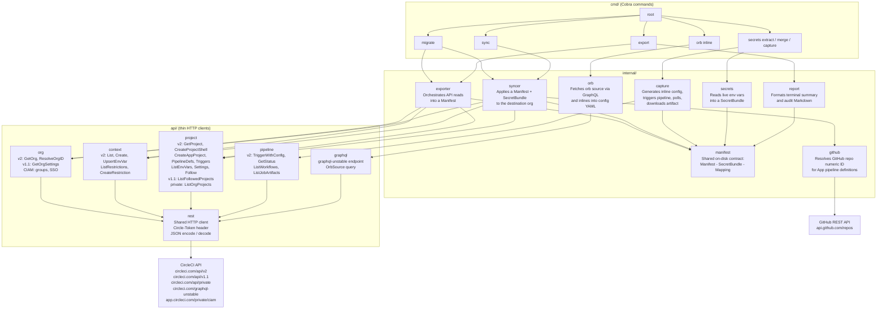
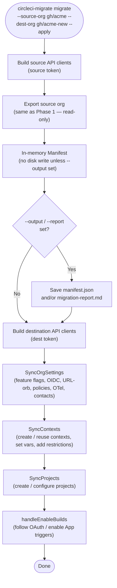
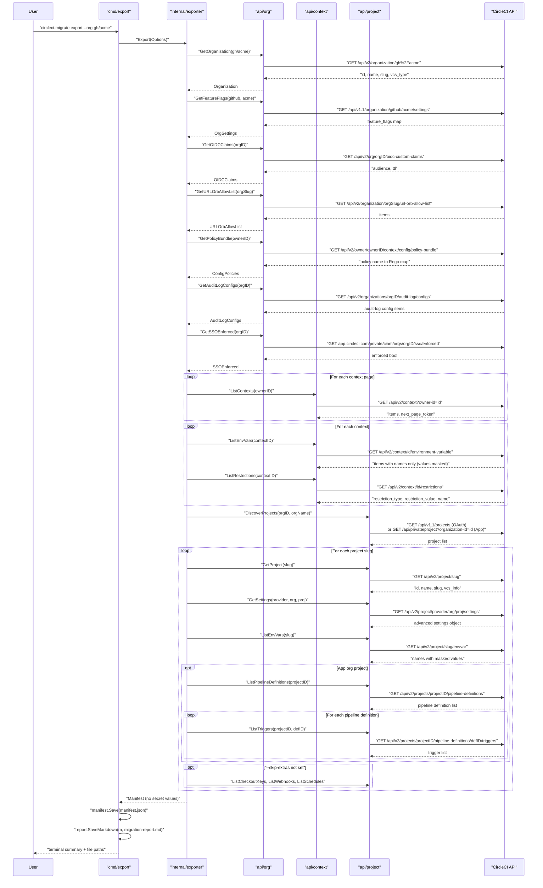
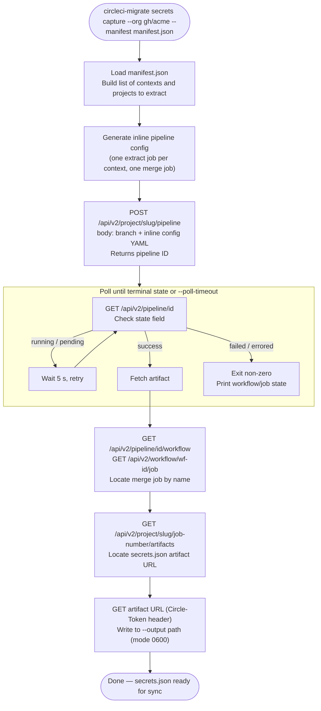
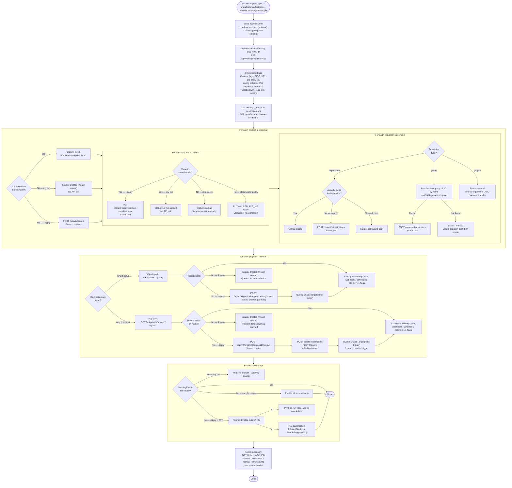
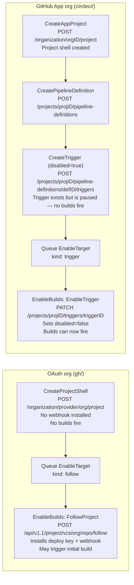
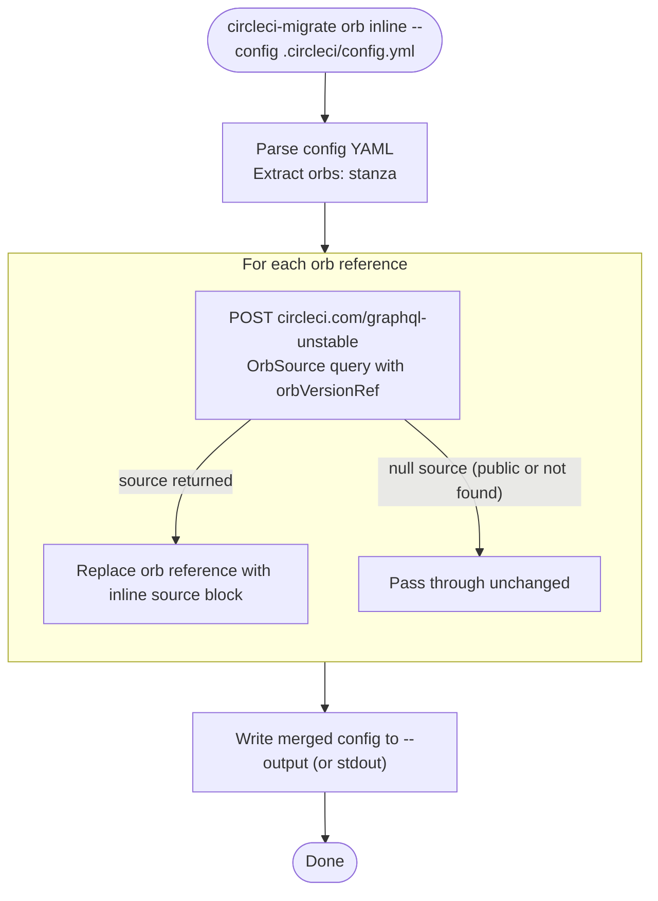

# Architecture and data flow

This document describes how `circleci-migrate` is structured and how data
moves through the system during each phase of a migration.

---

## Component diagram

`internal/manifest` is the shared data contract. Every command reads or
writes `Manifest`, `SecretBundle`, or `Mapping` structs from this package.
The API clients never depend on each other; they communicate only through
the manifest types.

---

## `migrate` command flow

`migrate` combines the export and sync steps into one command.
The manifest is held in memory; it is never written to disk unless
`--output` is passed.

---

## Phase 1 — Export flow

Key properties of the export phase:

- **Read-only.** No writes to CircleCI. Safe to run multiple times.
- **No secret values.** The API masks all values; the manifest records only
  names and metadata.
- **Best-effort per resource.** An error on one context or project produces a
  warning in the manifest and audit report, not a fatal failure.
- **Stable output.** Contexts, projects, and their variable lists are sorted
  by name so repeated exports of unchanged data produce identical files.

---

## Phase 2 — In-pipeline secret extraction

**Why one job per context?**

Each job can reference only the contexts listed under its `context:` key in
the workflow. If two contexts define a variable with the same name, combining
them in one job would cause one value to overwrite the other. Running one job
per context guarantees isolation.

The `secrets extract` command reads variable names from `manifest.json`, looks
each up in `os.LookupEnv`, and records found values in a `SecretBundle` JSON
file. Variables not present in the environment are listed under "Not found" in
the output (and cause a non-zero exit if `--strict` is passed).

After all extract jobs complete, the `merge` job combines the per-context
bundles into a single `secrets.json` using `secrets merge`.

---

## `secrets capture` — CLI-orchestrated flow

`secrets capture` achieves the same result as the orb-based Phase 2 without
requiring a committed `.circleci/config.yml`. The entire pipeline is generated
at runtime and submitted as an inline (unversioned) config via the v2 Pipelines
API.

Key differences from the orb-based approach:

- No `.circleci/config.yml` is committed to the repository.
- The inline config is ephemeral — it exists only for the duration of the run.
- `--enable-trigger` and `--remove-restrictions` allow the command to temporarily
  unlock contexts or triggers that would otherwise block the pipeline from running,
  restoring them after the run completes.
- `--skip-restricted-contexts` is a safer alternative: skip any context with
  active restrictions rather than modifying them.

---

## Phase 3 — Sync flow

---

## Project creation and enable-builds detail

The create-then-enable model ensures that builds never fire on a destination
project until you explicitly say so. The flow differs between org types:

**Webhook and schedule triggers** (App orgs) are flagged as `manual` — the
webhook HMAC secret cannot be migrated and schedule-trigger creation via the
Trigger API is a planned future addition.

---

Key properties of the sync phase:

- **Dry run by default.** No writes to CircleCI unless `--apply` is passed.
  Reviewing the dry-run output before applying is strongly recommended.
- **Idempotent.** Existing contexts and projects are reused by name. Re-running
  sync with `--apply` is safe — it will not duplicate resources or overwrite
  restrictions that already exist.
- **Transparent report.** Every action (created, exists, set, manual, error)
  is recorded and printed. Items requiring manual follow-up are surfaced
  explicitly.

---

## `orb inline` — GraphQL orb-source flow

The `orb inline` command rewrites a CircleCI config file, replacing each private
orb reference in the `orbs:` stanza with the orb's inlined YAML source. This is
used during the namespace-transfer overlap window (e.g. while `awesomecicd/`
content is being moved to `cci-labs/`) to produce a config that works regardless
of which namespace is active.

The GraphQL query (`OrbSource`) is sent to the `graphql-unstable` endpoint with
a `Circle-Token` header. The `source` field in the response is the raw orb YAML
string. Public orbs return a source but are left as references (they are
resolvable without a token). Private orbs with a `null` source are left as-is
with a warning — they require a token with access to that namespace.
