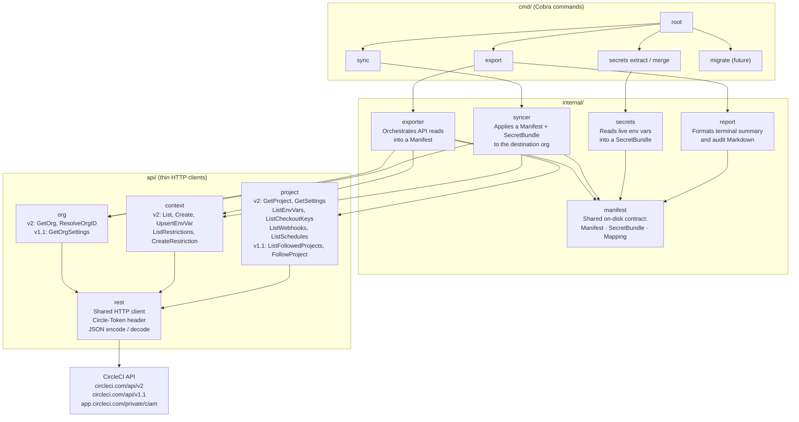
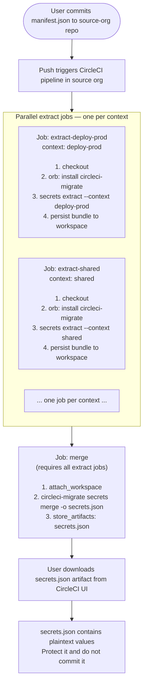
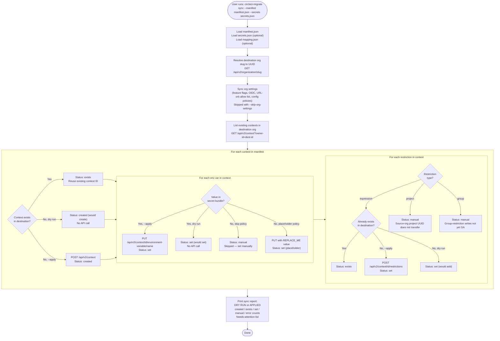

# Architecture and data flow

This document describes how `circleci-migrate` is structured and how data
moves through the system during each phase of a migration.

---

## Component diagram

`internal/manifest` is the shared data contract. Every command reads or
writes `Manifest`, `SecretBundle`, or `Mapping` structs from this package.
The API clients never depend on each other; they communicate only through
the manifest types.

---

## Phase 1 — Export flow

```mermaid
sequenceDiagram
    participant User
    participant export as "cmd/export"
    participant ex as "internal/exporter"
    participant orgAPI as "api/org"
    participant ctxAPI as "api/context"
    participant projAPI as "api/project"
    participant CCI as "CircleCI API"

    User->>export: circleci-migrate export --org gh/acme

    export->>ex: Export(Options)

    ex->>orgAPI: GetOrganization("gh/acme")
    orgAPI->>CCI: GET /api/v2/organization/gh%2Facme
    CCI-->>orgAPI: id, name, slug, vcs_type
    orgAPI-->>ex: Organization

    ex->>orgAPI: GetFeatureFlags("github", "acme")
    orgAPI->>CCI: GET /api/v1.1/organization/github/acme/settings
    CCI-->>orgAPI: feature_flags map
    orgAPI-->>ex: OrgSettings

    ex->>orgAPI: GetOIDCClaims(orgID)
    orgAPI->>CCI: GET /api/v2/org/orgID/oidc-custom-claims
    CCI-->>orgAPI: audience, ttl
    orgAPI-->>ex: OIDCClaims

    ex->>orgAPI: GetURLOrbAllowList(orgSlug)
    orgAPI->>CCI: GET /api/v2/organization/orgSlug/url-orb-allow-list
    CCI-->>orgAPI: items
    orgAPI-->>ex: URLOrbAllowList

    ex->>orgAPI: GetPolicyBundle(ownerID)
    orgAPI->>CCI: GET /api/v2/owner/ownerID/context/config/policy-bundle
    CCI-->>orgAPI: policy name to Rego map
    orgAPI-->>ex: ConfigPolicies

    ex->>orgAPI: GetAuditLogConfigs(orgID)
    orgAPI->>CCI: GET /api/v2/organizations/orgID/audit-log/configs
    CCI-->>orgAPI: audit-log config items
    orgAPI-->>ex: AuditLogConfigs

    ex->>orgAPI: GetSSOEnforced(orgID)
    orgAPI->>CCI: GET app.circleci.com/private/ciam/orgs/orgID/sso/enforced
    CCI-->>orgAPI: enforced bool
    orgAPI-->>ex: SSOEnforced

    loop For each context page
        ex->>ctxAPI: ListContexts(ownerID)
        ctxAPI->>CCI: GET /api/v2/context?owner-id=id
        CCI-->>ctxAPI: items, next_page_token
    end

    loop For each context
        ex->>ctxAPI: ListEnvVars(contextID)
        ctxAPI->>CCI: GET /api/v2/context/id/environment-variable
        CCI-->>ctxAPI: items with names only (values masked)

        ex->>ctxAPI: ListRestrictions(contextID)
        ctxAPI->>CCI: GET /api/v2/context/id/restrictions
        CCI-->>ctxAPI: restriction_type, restriction_value, name
    end

    ex->>projAPI: FollowedProjectsForOrg("acme")
    projAPI->>CCI: GET /api/v1.1/projects
    CCI-->>projAPI: flat array of project objects

    loop For each project slug
        ex->>projAPI: GetProject(slug)
        projAPI->>CCI: GET /api/v2/project/slug
        CCI-->>projAPI: id, name, slug, vcs_info

        ex->>projAPI: GetSettings(provider, org, proj)
        projAPI->>CCI: GET /api/v2/project/provider/org/proj/settings
        CCI-->>projAPI: advanced settings object

        ex->>projAPI: ListEnvVars(slug)
        projAPI->>CCI: GET /api/v2/project/slug/envvar
        CCI-->>projAPI: names with masked values

        opt --skip-extras not set
            ex->>projAPI: ListCheckoutKeys, ListWebhooks, ListSchedules
        end
    end

    ex-->>export: Manifest (no secret values)
    export->>export: manifest.Save("manifest.json")
    export->>export: report.SaveMarkdown(m, "migration-report.md")
    export-->>User: terminal summary + file paths
```

Key properties of the export phase:

- **Read-only.** No writes to CircleCI. Safe to run multiple times.
- **No secret values.** The API masks all values; the manifest records only
  names and metadata.
- **Best-effort per resource.** An error on one context or project produces a
  warning in the manifest and audit report, not a fatal failure.
- **Stable output.** Contexts, projects, and their variable lists are sorted
  by name so repeated exports of unchanged data produce identical files.

---

## Phase 2 — In-pipeline secret extraction

**Why one job per context?**

Each job can reference only the contexts listed under its `context:` key in
the workflow. If two contexts define a variable with the same name, combining
them in one job would cause one value to overwrite the other. Running one job
per context guarantees isolation.

The `secrets extract` command reads variable names from `manifest.json`, looks
each up in `os.LookupEnv`, and records found values in a `SecretBundle` JSON
file. Variables not present in the environment are listed under "Not found" in
the output (and cause a non-zero exit if `--strict` is passed).

After all extract jobs complete, the `merge` job combines the per-context
bundles into a single `secrets.json` using `secrets merge`.

---

## Phase 3 — Sync flow

Key properties of the sync phase:

- **Dry run by default.** No writes to CircleCI unless `--apply` is passed.
  Reviewing the dry-run output before applying is strongly recommended.
- **Idempotent.** Existing contexts are reused by name. Re-running sync with
  `--apply` is safe — it will not duplicate contexts or overwrite restrictions
  that already exist.
- **Transparent report.** Every action (created, exists, set, manual, error)
  is recorded and printed. Items requiring manual follow-up are surfaced
  explicitly.
